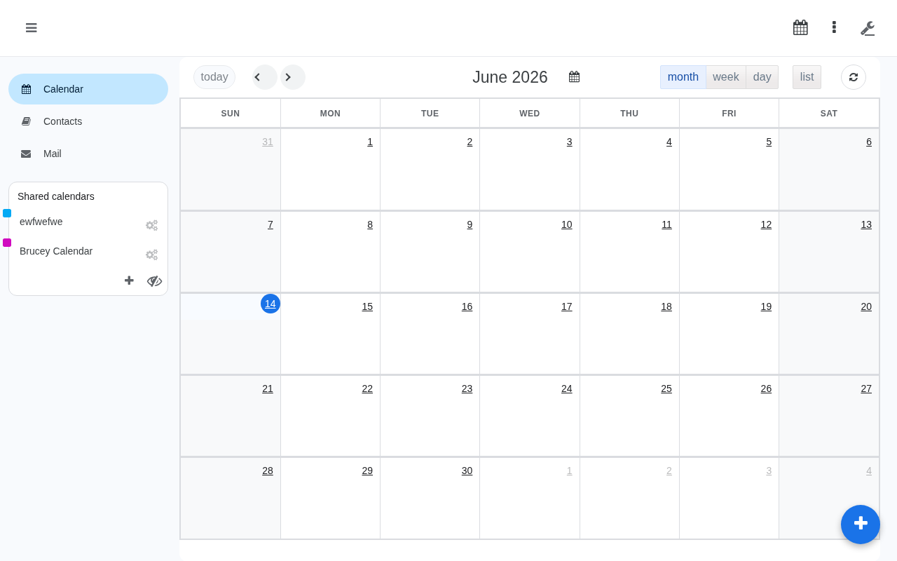

# Caldaver - CalDAV web client

[](https://github.com/caldaver-app/caldaver/actions)
[](https://github.com/caldaver-app/caldaver#requirements)
[](https://spdx.org/licenses/GPL-3.0-or-later.html)

Caldaver is a CalDAV web client which features an AJAX interface to allow
users to manage their own calendars and shared ones.



## Requirements

Caldaver requires:

- A CalDAV server like [Baïkal](http://baikal-server.com/),
  [DAViCal](http://www.davical.org/),
  [Radicale](https://radicale.org/tutorial/), etc
- A web server
- PHP >= 7.2.0
- PHP ctype extension
- PHP mbstring extension
- PHP mcrypt extension
- PHP cURL extension
- A database supported by
  [Doctrine DBAL](https://www.doctrine-project.org/projects/doctrine-dbal/en/2.12/reference/configuration.html#configuration)
  like MySQL, PostgreSQL, SQLite
- Optional: nodejs & npm to build assets (releases include a build)

## Documentation

The original upstream documentation is available at:
https://agendav.readthedocs.io/

## Installation

See the original upstream [installation guide](https://agendav.readthedocs.io/en/latest/admin/installation/)

### Docker Image

This fork includes a Docker image published to GitHub Container Registry as
`ghcr.io/caldaver-app/caldaver`. Daily builds are tagged with the UTC date in
`YYYY-MM-DD` format and the newest build is also tagged as `latest`.

The Docker packaging is based on
[nagimov/agendav-docker](https://github.com/nagimov/agendav-docker). Thank you
to Ruslan Nagimov for making that work available as a basis for this image.

Required runtime configuration:

- `CALDAVER_CALDAV_SERVER`, for example `https://baikal.example.com/cal.php`
- `CALDAVER_CSRF_SECRET`, set to a unique secret value and keep the same value across redeployments
- `CALDAVER_DB_HOST`
- `CALDAVER_DB_NAME`
- `CALDAVER_DB_USER`
- `CALDAVER_DB_PASSWORD`

Common optional runtime configuration:

- `CALDAVER_SERVER_NAME`, defaults to `localhost`
- `CALDAVER_TITLE`, defaults to `Caldaver`
- `CALDAVER_FOOTER`, defaults to `Caldaver`
- `CALDAVER_AUTH_USERNAME` and `CALDAVER_AUTH_PASSWORD`, set these to use a local Caldaver login instead of logging in directly with DAV server credentials
- `CALDAVER_CALDAV_PUBLIC_URL`, defaults to `CALDAVER_CALDAV_SERVER`
- `CALDAVER_CARDDAV_SERVER`, defaults to `CALDAVER_CALDAV_SERVER`
- `CALDAVER_CALDAV_USERNAME` and `CALDAVER_CALDAV_PASSWORD`, service credentials used by Caldaver when local login is enabled
- `CALDAVER_TIMEZONE`, defaults to `UTC`
- `CALDAVER_LANG`, defaults to `en`
- `CALDAVER_WEEKSTART`, defaults to `0`
- `CALDAVER_CALENDAR_SHARING`, defaults to `false`
- `CALDAVER_SESSION_LIFETIME`, session cookie and server-side session lifetime in seconds, defaults to `2592000` (30 days)

Example:

```sh
docker run -d --name caldaver \
  -p 8080:8080 \
  -e CALDAVER_CALDAV_SERVER=https://baikal.example.com/cal.php \
  -e CALDAVER_CSRF_SECRET=change-this-persistent-secret \
  -e CALDAVER_DB_HOST=postgres.example.com \
  -e CALDAVER_DB_NAME=caldaver \
  -e CALDAVER_DB_USER=caldaver \
  -e CALDAVER_DB_PASSWORD=change-this \
  ghcr.io/caldaver-app/caldaver:latest
```

## Upstream Source

https://github.com/agendav/agendav

## License

GNU General Public License v3.0 or later
https://spdx.org/licenses/GPL-3.0-or-later.html

Docker packaging derived from `nagimov/agendav-docker` is additionally covered
by Ruslan Nagimov's MIT license notice in
[`LICENSES/NAGIMOV-CALDAVER-DOCKER-MIT.txt`](./LICENSES/NAGIMOV-CALDAVER-DOCKER-MIT.txt).

## Changelog

See [CHANGELOG.md](./CHANGELOG.md)

## Contribution

[Contributions](./CONTRIBUTING.md) are welcome!
